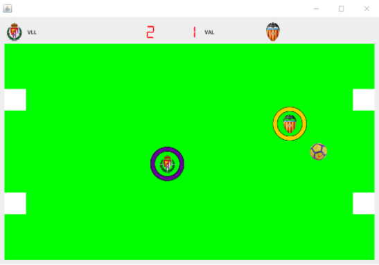

# AirFootball

> Jorge El Busto e Ibai Guillén
> 

> Programación III
> 

---

# Funcionamiento del proyecto

## Jugabilidad

Nuestro proyecto se trata de una especie de “Air Hockey”, pero con equipos de fútbol. Se juegan partidos de chapas entre dos jugadores (uno controlado por WASD, y otro controlado por las flechas). Los partidos son al mejor de 4 goles, salvo en el modo arcade, donde no puede haber empates y los partidos serán al mejor de tres.

## Modos de juego

Disponemos de cuatro modos: Modo arcade, modo creación, modo liga, y partido amistoso.

### Arcade

Una vez comienza a ejecutarse el proyecto por primera vez, se crea una base de datos con los 20 equipos por defecto que hay en la Liga Española introducidos en una tabla, y una tabla de jugadores de partidas arcade, donde se irán introduciendo los nombres y sus partidas ganadas (la PK es un atributo con el número de sesión Arcade que se va autoincrementando). 

El funcionamiento de este modo es realmente sencillo. Al hacer clic en modo arcade, se recorren los equipos que hay por defecto en la base de datos, y se inicia un partido entre dos de ellos (por ejemplo, Atlético de Madrid - Leganés). Al acabar dicho partido, si el equipo local gana (en teoría, sería si nosotros ganamos, pero nos ha faltado la IA), comienza otro partido entre dos equipos diferentes (por ejemplo, Real Sociedad - Villarreal CF). Una vez el equipo local pierde, se abre una ventana nueva donde podemos guardar nuestros datos. Una vez hayamos introducido el usuario y hayamos guardado nuestros datos, volveremos al menú principal.

### Liga

Todas las ligas se guardan en la BD, para cada usuario se crea una tabla para todas sus ligas y equipos, en esta tabla habrá un campo que se llame código de liga, el cual servirá para agrupar los equipos de la misma liga y poder de esta forma cargar la información de distintas partidas, sin mezclarlas entre usuarios ni entre partidas.

Una vez tengamos nuestra liga creada, nos saltará la ventana que tenemos como ejemplo aquí abajo (en este caso, hemos cargado una liga empezada). Tenemos cuatro equipos en zona de clasificación para la Champions League, dos que se clasificarán para la Europa League, y tres en zona de descenso. Un detalle a destacar es que, mientras nosotros vayamos jugando los partidos contra los equipos que nos van tocando a lo largo de la liga, se juegan el resto de partidos de fondo. Clara prueba de ello es la tabla de clasificación que vemos aquí abajo, donde todos los equipos han jugado sus respectivos partidos mientras nosotros jugábamos el nuestro (véase puntos, goles a favor, goles en contra, y demás).

Arriba tenemos marcado nuestro próximo evento, con nuestros puntos y los puntos del rival, y sus respectivos escudos. Una vez le demos al botón “Play”, comenzará un partido al mejor de cuatro con nuestro rival.

### Amistoso

El modo más simple es el de Partido Amistoso. Tenemos también los 20 equipos de la liga disponibles para jugar un partido al mejor de 4 goles. Una vez se marcan esos cuatro goles, volvemos al menú principal.

Cabe destacar que del modo amistoso no se guarda ninguna estadística de los equipos que han jugado, ni del resultado. Todo ello sí que se verá en el modo creación y en el modo liga.

### Creación

El modo creación es un modo donde, como su propio nombre indica, se te da la opción de crear tu propio equipo y sustituirlo por alguno de tu liga. Antes del menú creación, al igual que en el modo Liga, se te solicitará loguearte con tu usuario y contraseña. Una vez entras ya en el menú creación, tenemos la siguiente ventana:

El botón “Actualizar equipos” nos permite actualizar los equipos que estén en el ComboBox de “sustituir a equipo”, básicamente por si tenemos ya equipos creados previamente, para evitar bugs o fallos (imaginemos que hemos creado previamente un equipo sustituyendo al Alavés, no podemos crear otro equipo más tarde sustituyendo al Alavés porque ese equipo ya no existe en nuestra tabla, ha sido sustituido por uno que ya hemos creado). Introducimos el nombre, el escudo (que, al avanzar, se copiará a la carpeta SRC del proyecto para que el icono del equipo sea, por así decirlo, portable) y las siglas, y se borrará de la BD el equipo que nosotros queramos. Una vez hayamos terminado, le damos a “siguiente”, y podremos crear otro equipo más. Una vez hayamos creado todos los equipos que queramos, hacemos click a “Listo”.

¡Ya tenemos creado nuestro(s) equipo(s) listos para competir en una liga nueva! Como se puede observar en la tabla de la liga, nuestro equipo está, pero la Real Sociedad, que hemos marcado como equipo a sustituir en la ventana de arriba, no.

---

# Codificación

## Físicas

Disponemos de una clase de físicas, en la que se ha estructurado en función de tres choques diferentes:

**Choques entre pelota y equipo**: Los más importantes y los más complejos, si la pelota choca con un equipo este mediante la fórmula de choque elástico lanza la pelota. Además para evitar fallos, errores y/o bugs, si la pelota se queda dentro del equipo, se calcula en qué posición que está (arriba, abajo, izq.,der.) y se “saca” por ese lado. Esto está pensado para que cuando se quede en las esquinas del campo, y el equipo vaya a por ella se pueda jugar, es decir, la pelota se movería para un lado, para así poder sacarla de ahí.

**Choques entre pelota y márgenes del campo:** Los que garantizan que la pelota no salga del campo y que tome rebotes intuitivos, de esta manera el juego coge la gracia que tiene, ya que los rebotes hacen que sea más difícil ganar, hemos aplicado una pérdida de velocidad con cada rebote en los laterales para hacerlo más realista.

**Choques entre pelota y los postes**: Los hemos simplificado de tal forma que el choque sea totalmente inelástico y la dirección de rebote sea totalmente opuesta a la de llegada, por lo cual será algo más irreal, pero de esta forma, debido a la dificultad del juego el balón volvería al lanzador para darle otra oportunidad.

## Mecanismo de juego

El juego se desarrolla en un hilo que, comienza calculando todos los choques (si ocurren), después aplica las correcciones pertinentes moviendo cada objeto (según las físicas desarrolladas), seguidamente se degrada la velocidad de esos objetos para simular un efecto de rozamiento con la superficie y se actualiza la posición de los jLabel para establecer la de los objetos correspondientes, por último se actualiza el campo para visualizar todo. El juego detectará gol si solo si la pelota está entre los dos palos y toca el lateral derecho, de esta forma simplificamos el algoritmo utilizando el sensor de si la bola está tocando el lateral.

## Gestión de la BD

Disponemos de 4 tablas predefinidas en el proyecto:

Liga: Guarda todas las ligas que hay con su correspondiente usuario

[https://lh3.googleusercontent.com/Coh9shU9vG-_1xeBphFg4FiRFjv2JjdHNh9xoLYwTsY6M8hXyJLer11u-hyy43OqGRpZJpo0Z3eWgfM0WJbAHegnXvV0fziXuk_Bmh84cZeuHQYeOtInm8cWTkiknWV6ArLvrhf8](https://lh3.googleusercontent.com/Coh9shU9vG-_1xeBphFg4FiRFjv2JjdHNh9xoLYwTsY6M8hXyJLer11u-hyy43OqGRpZJpo0Z3eWgfM0WJbAHegnXvV0fziXuk_Bmh84cZeuHQYeOtInm8cWTkiknWV6ArLvrhf8)

Arcade: Guarda la puntuación histórica del modo arcade

[https://lh5.googleusercontent.com/Bir6gHvZXadZwWoPYZ1_MYwHvBiTYvFTTr1o9vswBThz8RYBCHz7SzBUErQrnhcEAd2nig3atMkAmPhn6E9cODh1rI_PbmsxjSr00OAZVn9cKulGWFG792CQYZFkOF_XI9ie3mld](https://lh5.googleusercontent.com/Bir6gHvZXadZwWoPYZ1_MYwHvBiTYvFTTr1o9vswBThz8RYBCHz7SzBUErQrnhcEAd2nig3atMkAmPhn6E9cODh1rI_PbmsxjSr00OAZVn9cKulGWFG792CQYZFkOF_XI9ie3mld)

Equipos: Guarda los equipos predefinidos, de los que se parte en los amistosos y antes de creación.

[https://lh6.googleusercontent.com/rhSqE2qIuresNLOx8aOk8hxvqaVpybY1OQiEIYlTOMJVp-qTru39-jOP54wGNvZNZX8U4Tj035CVp7X4cYe_dbY9AxLfZWgxyh0RKxk3-2xwgRPd9do-dRpmCp2qCA2euQmhctnZ](https://lh6.googleusercontent.com/rhSqE2qIuresNLOx8aOk8hxvqaVpybY1OQiEIYlTOMJVp-qTru39-jOP54wGNvZNZX8U4Tj035CVp7X4cYe_dbY9AxLfZWgxyh0RKxk3-2xwgRPd9do-dRpmCp2qCA2euQmhctnZ)

[https://lh4.googleusercontent.com/jWGYkH9ZikdRo2LdSqBbGzk6ZnY6W2muDVP0g1tx4ArSoJwgoy4MGOEGdQgliPPXEH4dm-lavl4yhc-C6cyDr0As4zs_0dHKw2akZ7wnmcp1so-biPVRk0ho7HcaYprB83mgPPLI](https://lh4.googleusercontent.com/jWGYkH9ZikdRo2LdSqBbGzk6ZnY6W2muDVP0g1tx4ArSoJwgoy4MGOEGdQgliPPXEH4dm-lavl4yhc-C6cyDr0As4zs_0dHKw2akZ7wnmcp1so-biPVRk0ho7HcaYprB83mgPPLI)

Jugadores: Guarda la información de los jugadores, nombre, contraseña y cantidad de ligas que tienen.

[https://lh3.googleusercontent.com/08vQPNlwL8UcoYFgmRve0KjEZaRnzT4J-KeRqYXKpJAaEB1U96JlMBy1FzH5lAiqu5zn9PAvOrQNMlBdW1qRg8J2xe3Fn70LttJpouaq2dk3gFbjBHagvvxiGgqf12QbxPPmoVK3](https://lh3.googleusercontent.com/08vQPNlwL8UcoYFgmRve0KjEZaRnzT4J-KeRqYXKpJAaEB1U96JlMBy1FzH5lAiqu5zn9PAvOrQNMlBdW1qRg8J2xe3Fn70LttJpouaq2dk3gFbjBHagvvxiGgqf12QbxPPmoVK3)

Además, con cada jugador registrado se crea una tabla que toma el nombre de ‘Equipos’ + el nombre del jugador. En esta se guardarán todos los equipos de todas las partidas, y se agruparan por el código de liga, el cual usaremos para diferenciar y actualizar datos.

[https://lh4.googleusercontent.com/XGEROSri01hBKUcl4J4r3EU81l_uRN4-KUPv9EtbigU351luTKQSYqIyQn4NEkOPdUwV6XVyGul6fhZqLtfYBxgo7Qf1AmYaGHdNm8DucMgSEvr3HNKANBT1vbvI9CxnsZUCwHZb](https://lh4.googleusercontent.com/XGEROSri01hBKUcl4J4r3EU81l_uRN4-KUPv9EtbigU351luTKQSYqIyQn4NEkOPdUwV6XVyGul6fhZqLtfYBxgo7Qf1AmYaGHdNm8DucMgSEvr3HNKANBT1vbvI9CxnsZUCwHZb)

[https://lh4.googleusercontent.com/L7sy-59MmMDkMPwXiVHV5LBh1hcCgyVFRc7pveJl95ptOs5Gl73nAFLAvTjfVMqBwnyM9KzQFUZEkVz6x8f_t6YueFPh_DyCiJKl1UglQ_1b0GLdQI5Ts7j9X-4rFvKjEJ5gdfbY](https://lh4.googleusercontent.com/L7sy-59MmMDkMPwXiVHV5LBh1hcCgyVFRc7pveJl95ptOs5Gl73nAFLAvTjfVMqBwnyM9KzQFUZEkVz6x8f_t6YueFPh_DyCiJKl1UglQ_1b0GLdQI5Ts7j9X-4rFvKjEJ5gdfbY)

Hemos incluido un logger en la base de datos para que en caso de haber problemas se pueda encontrar el motivo de ellos y de esa forma poder arreglarlos.

## Gestión de partidas

En el proyecto hemos creado un sistema de gestión de partidas con el siguiente formato:

A la hora de **crear** una partida se generará un fichero con *tu nombre + “codLiga=” + el código de liga de la partida generada*. Dentro de este fichero se guardará el equipo con el que has elegido jugar esta liga, ya que si se empieza una liga independientemente del momento en el que la quieras cargar deberás de seguir con ese mismo equipo, además se generará un fichero llamado *nombre de usuario + código de liga + “Partidos”*  el cual albergará una lista de todos los partidos que tendrás que jugar, y en el orden que deberás de jugarlos.

A la hora de **cargar** se debe seleccionar el archivo  *nombre + “codLiga=” + el código de liga* de la partida que quieras, y seguidamente el programa leerá los rivales del fichero y los cargará, de tal manera que puedas continuar la partida tal como la dejaste.

## Calendario de la liga

Como bien hemos dicho arriba, los equipos de la liga se cargan a partir del usuario, el código de liga y la base de datos. Sin embargo, hemos realizado también otras dos sentencias SQL de vital importancia a la hora de terminar el partido.

Una va a ser una consulta al azar que nos vaya devolviendo uno a uno los equipos de la liga que no son el nuestro, ni el equipo contra el que hemos jugado, y, cada equipo al azar escogido es emparejado con el siguiente equipo del ResultSet. Por cada elemento del ResultSet se realiza una sentencia SQL antes de pasar al siguiente equipo. Elegimos un número al azar entre 0, 1 y 3 (los puntos que va a sumar el equipo después del partido por haber ganado, empatado o perdido), y si al primer elemento del ResultSet le tocan los 3 puntos, sabemos que ha ganado o 3-1 o 4-0, ya que los partidos son al mejor de cuatro. Se elige un resultado al azar de esos dos, y al siguiente elemento del ResultSet se le añadirá justo lo contrario: 0 puntos, 1 ó 0 goles a favor y 3 ó 4 goles en contra, en función del resultado del equipo anterior.

Vemos aquí una imagen de prueba del calendario de la Liga tras la primera jornada (comparando los primeros seis equipos de la tabla y los últimos, el resto empatan a dos y las estadísticas se reparten por igual). El Real Murcia no está en primera división, pero lo hemos metido en una liga mediante el modo creación:

[https://lh6.googleusercontent.com/qZ0-C1ZVfy1Mn63L4r265bfcBvxneK7FsZISsWY_soAaZ8g0NM8rdpYxu4uUd0RsiwKXEzzok5Fn4caWerifVd_SwJO2tGfFyfYMN12GOixR5nUjXVYQDZbRZQFyyAUEfOvnLvzI](https://lh6.googleusercontent.com/qZ0-C1ZVfy1Mn63L4r265bfcBvxneK7FsZISsWY_soAaZ8g0NM8rdpYxu4uUd0RsiwKXEzzok5Fn4caWerifVd_SwJO2tGfFyfYMN12GOixR5nUjXVYQDZbRZQFyyAUEfOvnLvzI)

[https://lh6.googleusercontent.com/WhC32U7eDCh_udMCdya49fG0NUzTODx86Rj260SvoL-v_4HR1O-fO0uXICAFIamRiWTm9hAmjvQskoToFX5CJ82T1qJIFevkVPRgOSxCrO0bahbJVlMQIi-YB85kgUQxzeY8bWpC](https://lh6.googleusercontent.com/WhC32U7eDCh_udMCdya49fG0NUzTODx86Rj260SvoL-v_4HR1O-fO0uXICAFIamRiWTm9hAmjvQskoToFX5CJ82T1qJIFevkVPRgOSxCrO0bahbJVlMQIi-YB85kgUQxzeY8bWpC)

Los equipos se ordenan por puntos como primer criterio y el *goalaverage* (diferencia entre goles marcados y recibidos) como segundo criterio. En este caso, hemos hecho pruebas con partidos al mejor de tres y por eso nuestro equipo, el Murcia, sale con tres goles a favor y cero en contra (se puede apreciar que el resto han jugado al mejor de cuatro), y vemos cómo los equipos con mejor clasificación son los que más puntos llevan, y entre todos esos que tienen tres puntos, los que tienen un *goalaverage* mayor son los que mejor posición está.

## Modo arcade

En el modo arcade la codificación es realmente simple. Mediante sentencias SQL elegimos al azar dos equipos para que se enfrenten entre ellos, y si el equipo local gana, se eligen otros dos al azar para seguir jugando.

Dichas sentencias SQL las hemos introducido en un **método recursivo** para *randomizar* los equipos. A dicho método se le pasa un equipo, y te lo convierte a un equipo al azar antes de devolvértelo. Era un algoritmo que tratamos de realizar primeramente con un void, pero posteriormente vimos la posibilidad de crear dicho método pasándole un equipo y que se nos devuelva uno aleatorio, y finalmente el método ha terminado funcionando a la perfección, sin bugs ni errores de por medio.

Para terminar, se detecta que el local ha perdido el partido y salta a la ventana de guardar usuarios del modo arcade únicamente si el boolean esArcade está activado (algo que se activa simplemente haciendo click al modo arcade en el menú de inicio). Mediante sentencias SQL mostramos ordenadamente los usuarios que poseen los mayores registros de partidas ganadas, y mediante otra sentencia SQL, introducimos el jugador con sus partidas ganadas en la tabla.

## JUnit y Test

Hemos desarrollado varios test en el proyecto, pero hemos decidido mantener por limpieza solo unos pocos, estos indican que las clases básicas funcionan bien y no hay ningún error grave.

Con esto queremos decir que si hay un constructor que sea null por ejemplo poder identificarlo sería clave para evitar errores, ya que de no identificarlo a lo mejor podría llevarnos horas encontrar el error e incluso que provoquemos otros tratando de solucionarlo.

Además es de reseñar que hemos usado esto para asegurarnos de ciertos métodos de la BD para identificar antes las mejoras.

---